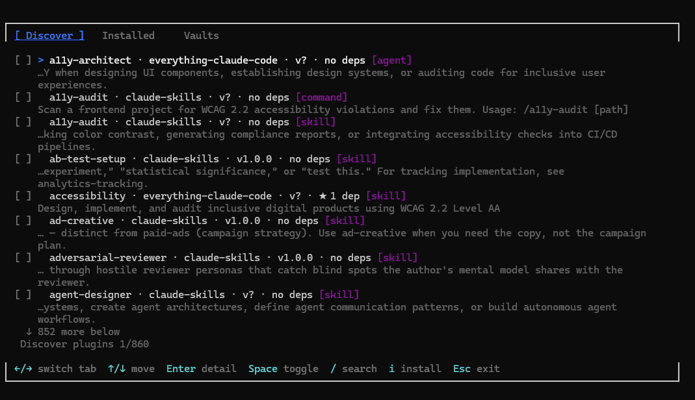

# Plug

[](https://github.com/dsiddharth2/plug/actions/workflows/ci.yml)
[](LICENSE)
[](https://nodejs.org)

**Plug** is a package manager for [Claude Code](https://docs.anthropic.com/en/docs/claude-code). It allows you to share, discover, and install reusable skills, commands, and agents across your projects via a rich, interactive Terminal User Interface (TUI).

## Why Plug?

Managing Claude Code extensions (Skills, Commands, and Agents) manually can quickly become unmanageable. Plug solves several key problems:

*   **Corporate & Private Ecosystems**: Easily set up internal "Vaults" (GitHub repositories) to share proprietary coding standards, security guardrails, and specialized agents within your organization.
*   **Consolidated Management**: Instead of maintaining multiple harnesses or manually copying Markdown files across different projects, Plug provides a single tool to discover, install, and update everything.
*   **PlugVault Ecosystem**: Access a centralized, growing registry of community-contributed extensions through the official `plugvault`, or add your own custom vaults.
*   **Zero-Bloat Workflow**: Keep your projects clean by installing only what you need, either locally to a project (`.claude/`) or globally (`~/.claude/`).

---

## 🚀 Quick Start: The Plug TUI

The recommended way to use Plug is through its interactive TUI. It allows you to browse, search, and batch-install extensions without remembering complex commands.


*(A rich, interactive interface for managing your Claude extensions)*

### 1. Install Plug
Install as a Claude Code skill (recommended, no Node.js required):
```bash
bash <(curl -sf https://raw.githubusercontent.com/dsiddharth2/plug/main/plug/skill/install.sh)
```
*Or via npm for the CLI:* `npm install -g plugvault`

### 2. Launch the TUI
Simply run the command to enter the interactive browser:
```bash
/plug  # If installed as a skill
plug   # If installed via npm
```

### 3. Browse & Install
*   **Navigate**: Use `Arrows` to move through the package list.
*   **Search**: Press `/` to search by name or tags.
*   **Select**: Press `Space` to select multiple packages.
*   **Install**: Press `Enter` to install everything in your queue.

---

## What is Plug?

Claude Code extensions (Skills, Commands, and Agents) are Markdown files. Plug simplifies managing these files, making it as easy as using `npm` for Node.js.

*   **Skills** — Background context that shapes Claude's behavior (coding standards, architecture rules).
*   **Commands** — Custom actions invoked with `/command-name` (code review, test generation).
*   **Agents** — Specialized sub-agents for delegation (research, long-running analysis).

---

## 🔮 Vision & Roadmap: Claude Native Integration

We are building a zero-latency, native integration with Claude Code. Soon, you'll be able to manage your extensions directly from within a Claude conversation:

*   **`/plug` Slash Command**: A smart, terminal-native installer that avoids the need to switch windows.
*   **Natural Language Discovery**: "Claude, I need a tool for security audits" — Claude finds the right package from the vault and installs it instantly.
*   **One-Click Management**: Update and remove packages through interactive Claude panels.

View the full [Claude Integration Vision](docs/project/vision-claude-integration.md).

---

## Documentation

*   **[TUI Guide](docs/features/tui.md)** — Detailed breakdown of the interactive interface and hotkeys.
*   **[Architecture](docs/architecture.md)** — How Plug works under the hood (including our Context-Aware Capture system).
*   **[Authoring Guide](docs/authoring-guide.md)** — Learn how to create and publish your own packages.
*   **[Vaults & Registries](docs/features/vaults.md)** — Managing public and private package sources.

---

## Contributing

We welcome contributions! Please see our [Contributing Guidelines](plug/CONTRIBUTING.md) for details on how to get involved.

---

## License

MIT © [Siddharth](https://github.com/dsiddharth2)
